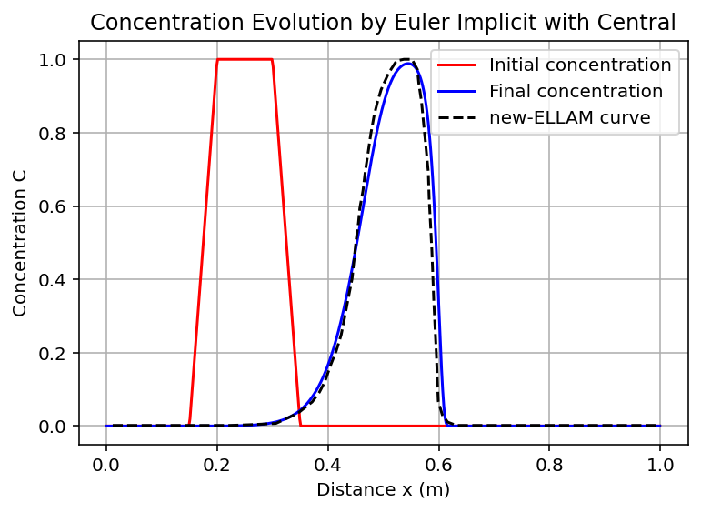
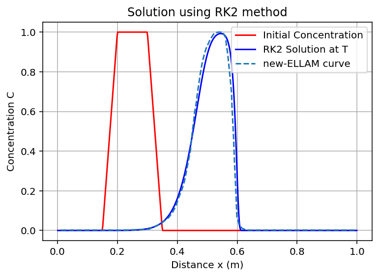
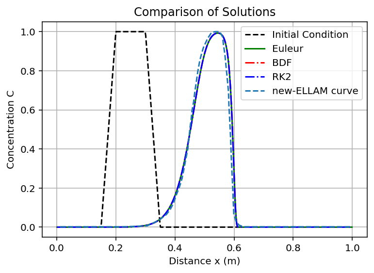
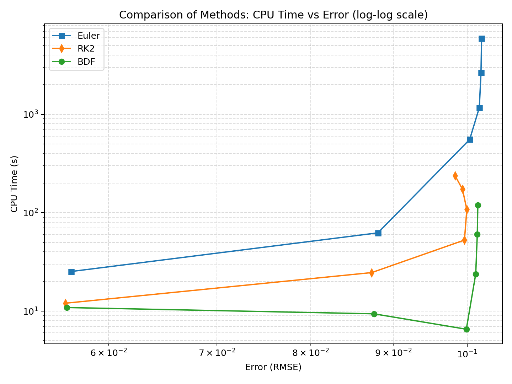

# Higher-Order Time Integration for Nonlinear Reactive Transport in Porous Media

### Finite Volumes · Euler · RK2 · Variable-Order BDF · Error and CPU Comparison

This repository is the computational companion to my Master's thesis in Applied Mathematics:

> **Using Higher-Order Time Integration Technique for Solving Nonlinear Reactive Transport Equation in Porous Media**

**Kassem Al Halaby**  
Lebanese University — Faculty of Sciences  
Supervisor: **Prof. Marwan Fahs, University of Strasbourg**

---

## 1. Research objective

The thesis studies the effect of the **time integration technique** on the numerical solution of a nonlinear reactive transport problem discretized in space with the **finite volume method**.

The central question is:

> **How can we preserve an accurate and stable numerical solution while reducing the computational cost required to reach the final time?**

The comparison is performed using three time-integration strategies applied to the same finite-volume spatial discretization:

- **Implicit Euler (BDF1)** with central advection;
- **Explicit RK2** (midpoint/second-order Runge–Kutta);
- **Variable-order BDF** (high-order implicit multistep integration).

The main quantitative criteria are the **discrete $L^2$ error (RMSE)** and the **CPU time**.

---

## 2. Mathematical problem

On the one-dimensional domain

$$\Omega=(0,L)$$

the nonlinear reactive transport equation is written as

$$R(C)\frac{\partial C}{\partial t} +V\frac{\partial C}{\partial x} -D\frac{\partial^2 C}{\partial x^2}=0$$

with the concentration-dependent retardation factor

$$R(C)=1+\frac{\rho_b}{\varepsilon}K_f n_f C^{n_f-1}$$

The nonlinear sorption is described by the Freundlich isotherm

$$S(C)=K_f C^{n_f}$$

or, equivalently,

$$M(C)=C+\frac{\rho_b}{\varepsilon}K_f C^{n_f}$$

The nonlinear storage term is responsible for the concentration-dependent retardation and contributes to the stiffness of the semi-discrete system.

---

## 3. Finite-volume spatial discretization

The spatial operator is constructed with a **cell-centred finite-volume discretization**.

For the central advective closure,

$$R(C_i)\frac{dC_i}{dt} +V\frac{C_{i+1}-C_{i-1}}{2\Delta x} -D\frac{C_{i+1}-2C_i+C_{i-1}}{\Delta x^2}=0$$

For the upwind closure ($V>0$),

$$R(C_i)\frac{dC_i}{dt} +V\frac{C_i-C_{i-1}}{\Delta x} -D\frac{C_{i+1}-2C_i+C_{i-1}}{\Delta x^2}=0$$

This finite-volume discretization produces the method-of-lines system

$$\frac{dC}{dt}=f(C), \qquad C=(C_1,\ldots,C_N)^T$$

which is then advanced in time.

---

## 4. Time integration techniques

### Implicit Euler

Implicit Euler is first order and coincides with BDF1:

$$C^{n+1}=C^n+\Delta t\,f(C^{n+1})$$

For the nonlinear transport model, each step is solved with **Newton–Raphson iteration** using the analytical Jacobian.

### Explicit RK2

The second-order midpoint scheme is

$$k_1=f(C^n), \qquad k_2=f\left(C^n+\frac{\Delta t}{2}k_1\right), \qquad C^{n+1}=C^n+\Delta t\,k_2$$

It improves temporal accuracy but remains subject to explicit stability restrictions.

### Variable-order BDF

BDF methods use several previous time levels to construct a backward approximation to the time derivative. The implementation used in the thesis employs **variable order and variable step size**, with implicit treatment of the stiff nonlinear ODE system.

The important practical advantage investigated in the thesis is the ability of implicit BDF integration to maintain reliable accuracy while using **larger time steps** than explicit schemes in stiff regimes.

---

## 5. Test case

The benchmark is a one-dimensional nonlinear reactive transport problem with a trapezoidal slug initial condition.

| Parameter | Value |
|---|---:|
| $L$ | $1$ m |
| $T$ | $0.4$ day |
| $V$ | $1$ m/day |
| $D$ | $10^{-3}$ m$^2$/day |
| $\varepsilon$ | $0.4$ |
| $\rho_b$ | $1.59$ |
| $K_f$ | $0.126$ |
| $n_f$ | $0.7$ |
| $C(0,t)$ | $0$ |
| $C(L,t)$ | $0$ |

The reference profile used for qualitative validation is the **new-ELLAM curve digitized from Younes, Fahs and Ackerer (2008)**. It is used to compare the shape and location of the transported concentration profile; the quantitative comparison below uses the thesis error data.

---

## 6. Terminal solutions

### Implicit Euler with central flux



### Explicit RK2



### Variable-order BDF


### Unified comparison

The three terminal profiles are superposed with the initial condition and the new-ELLAM reference curve.



On the tested case, the three methods reproduce essentially the same transported profile. The differences are much more visible in **computational cost and allowable time-step size** than in the final concentration curve.

---

## 7. Quantitative comparison: $L^2$ error and CPU time

For a common set of reference points $x_j$, the thesis uses the discrete root-mean-square error

$$\|e\|_{L^2} = \left( \frac{1}{M} \sum_{j=1}^M \left(C^{\mathrm{num}}(x_j)-C^{\mathrm{ref}}_j\right)^2 \right)^{1/2}$$

The CPU time is the measured wall-clock time required to reach the final simulation time $T$.

The comparison is performed on

$$N\in\{100,200,500,1000,1500,2000\}$$

### Thesis results

| Mesh $N$ | Euler Error | Euler CPU (s) | RK2 Error | RK2 CPU (s) | BDF Error | BDF CPU (s) |
|---:|---:|---:|---:|---:|---:|---:|
| 100  | 0.056885 | 25.2758 | 0.056408 | 12.0280 | 0.056544 | 10.8727 |
| 200  | 0.088037 | 62.4314 | 0.087272 | 24.6468 | 0.087546 | 9.3910 |
| 500  | 0.100335 | 555.6708 | 0.099590 | 52.7572 | 0.099858 | 6.5473 |
| 1000 | 0.101723 | 1171.5245 | 0.099928 | 107.7137 | 0.101202 | 23.8584 |
| 1500 | 0.101966 | 2667.9383 | 0.099311 | 173.2807 | 0.101429 | 60.1878 |
| 2000 | 0.102051 | 5913.4078 | 0.098270 | 237.8288 | 0.101506 | 119.2037 |

The complete numerical table is stored in [`results/comparison_results.csv`](results/comparison_results.csv).

### CPU time versus error



The log–log work/accuracy diagram makes the computational difference particularly clear. Euler becomes increasingly expensive as the mesh is refined. RK2 is less expensive than Euler in the reported experiments but still requires explicit time integration. Variable-order BDF provides the most favourable CPU/error balance for the stiff nonlinear problem, while retaining the accuracy of the terminal profile.

---

## 8. Main conclusion of the thesis

The numerical experiments support the main conclusion that **higher-order implicit BDF time integration is a strong choice for stiff nonlinear reactive transport**.

The key point is not simply that BDF is more accurate. Rather,

$$\textbf{stability} \;+\; \textbf{accuracy} \;+\; \textbf{larger admissible time steps}$$

can be obtained within the same finite-volume framework, which leads to a substantially more favourable computational cost than the explicit alternatives in the tested stiff regime.

---

## 9. Repository structure

```text
reactive-transport-time-integration/
├── data/
│   └── new_ellam_reference.csv
├── figures/
│   ├── euler_implicit_central.png
│   ├── rk2_solution.png
│   ├── bdf_solution.png
│   ├── comparison_overlay.png
│   ├── comparison_overlay_reproduced.png
│   ├── cpu_vs_error.png
│   └── cpu_vs_error_reproduced.png
├── results/
│   ├── comparison_results.csv
│   └── comparison_results.md
├── src/
│   ├── implicit_euler_central.py
│   ├── rk2.py
│   ├── bdf.py
│   ├── compare_profiles.py
│   └── performance_comparison.py
├── CITATION.cff
├── LICENSE
├── requirements.txt
└── README.md
```

---

## 10. Reproducibility

Install the dependencies:

```bash
python -m pip install -r requirements.txt
```

The scripts in `src/` contain the numerical implementations used for the three time-integration approaches and the final comparison. The reported thesis table is preserved in `results/comparison_results.csv`.

The figures in `figures/` are the figures used in the thesis. They are not overwritten by the scripts.

Two entry points are runnable directly:

```bash
cd src
python compare_profiles.py        # runs the three integrators on ne = 500
python performance_comparison.py  # replots the archived thesis table
```

`compare_profiles.py` recomputes the terminal profiles and writes
`figures/comparison_overlay_reproduced.png`, so the archived thesis overlay and a
freshly computed one can be placed side by side. On `ne = 500` with
$\Delta t = 4$ s it reports a maximum pointwise difference of
$7.8\times10^{-3}$ between implicit Euler and BDF, and $7.7\times10^{-6}$
between RK2 and BDF: at this resolution the three integrators agree on the
profile, and the differences reported in section 7 are differences in cost.

---

## Reference

A. Younes, M. Fahs and P. Ackerer, *A new approach to avoid excessive numerical diffusion in Eulerian–Lagrangian methods*, Communications in Numerical Methods in Engineering, 24(11), 897–910, 2008. DOI: 10.1002/cnm.996.

Additional numerical-analysis references used in the thesis are listed in `docs/references.bib`.

---

## Author

**Kassem Al Halaby**  
Applied Mathematics — Lebanese University  
Master's research supervised by **Prof. Marwan Fahs (University of Strasbourg)**
